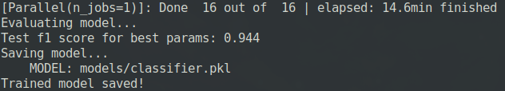

# Data Scientist Nanodegree

## Data Engineering

## Project: Disaster Response Pipeline

## Table of Contents

- [Project Overview](#overview)
- [Project Components](#components)
  - [ETL Pipeline](#etl_pipeline)
  - [ML Pipeline](#ml_pipeline)
  - [Flask Web App](#flask)
- [Running](#run)
  - [Data Cleaning](#cleaning)
  - [Training Classifier](#training)
  - [Starting the Web App](#starting)
- [Conclusion](#conclusion)
- [Files](#files)
- [Software Requirements](#sw)
- [Credits and Acknowledgements](#credits)

***

<a id='overview'></a>

## 1. Project Overview

In this project, I'll apply data engineering to analyze disaster data from <a href="https://www.figure-eight.com/" target="_blank">Figure Eight</a> to build a model for an API that classifies disaster messages.

_data_ directory contains a data set which are real messages that were sent during disaster events. I will be creating a machine learning pipeline to categorize these events so that appropriate disaster relief agency can be reached out for help.

This project will include a web app where an emergency worker can input a new message and get classification results in several categories. The web app will also display visualizations of the data.

[Here](#eg) are a few screenshots of the web app.

<a id='components'></a>

## 2. Project Components

There are three components of this project:

<a id='etl_pipeline'></a>

### 2.1. ETL Pipeline

File _data/process_data.py_ contains data cleaning pipeline that:

- Loads the `messages` and `categories` dataset
- Merges the two datasets
- Cleans the data
- Stores it in a **SQLite database**

<a id='ml_pipeline'></a>

### 2.2. ML Pipeline

File _models/train_classifier.py_ contains machine learning pipeline that:

- Loads data from the **SQLite database**
- Splits the data into training and testing sets
- Builds a text processing and machine learning pipeline
- Trains and tunes a model using GridSearchCV
- Outputs result on the test set
- Exports the final model as a pickle file

<a id='flask'></a>

### 2.3. Flask Web App

<a id='eg'></a>

Running [this command](#com) **from app directory** will start the web app where users can enter their query, i.e., a request message sent during a natural disaster, e.g. _"Please, somebody help me! My uncle drowned with the flood and he's not responding, I think he's dead. We are in the rooftop, Thank you!"_.

**_Screenshot 1_**


What the app will do is that it will classify the text message into categories so that appropriate relief agency can be reached out for help.

**_Screenshot 2_**


<a id='run'></a>

## 3. Running

There are three steps to get up and runnning with the web app if you want to start from ETL process.

<a id='cleaning'></a>

### 3.1. Data Cleaning

**Go to the project directory** and the run the following command:

```bat
python data/process_data.py data/disaster_messages.csv data/disaster_categories.csv data/DisasterResponse.db
```

The first two arguments are input data and the third argument is the SQLite Database in which we want to save the cleaned data. The ETL pipeline is in _process_data.py_.

**_Screenshot 3_**


<a id='training'></a>

### 3.2. Training Classifier

After the data cleaning process, run this command **from the project directory**:

```bat
python models/train_classifier.py data/DisasterResponse.db models/classifier.pkl
```

This will use cleaned data to train the model, improve the model with grid search and saved the model to a pickle file (_classifer.pkl_).

_classifier.pkl_ already exists but the above command will still run and replace the file will same information.

_**Screenshot 4**_


It took me around **15 minutes** to train the classifier with grid search.

When the models is saved, it will look something like this.

<a id='acc'></a>

**_Screenshot 5_**



<a id='starting'></a>

### 3.3. Starting the web app

Now that we have cleaned the data and trained our model. Now it's time to see the prediction in a user friendly way.

**Go the app directory** and run the following command:

<a id='com'></a>

```bat
python run.py
```

This will start the web app and will direct you to a URL where you can enter messages and get classification results for it.

**_Screenshot 6_**


<a id='conclusion'></a>

## 4. Conclusion

Some information about training data set as seen on the main page of the web app.

**_Screenshot 7_**


**_Screenshot 8_**


As we can see the data is highly imbalanced. Though the accuracy metric is [high](#acc) (you will see the exact value after the model is trained by grid search, it is ~0.94), it has a poor value for recall (~0.6). So, take appropriate measures when using this model for decision-making process at a larger scale or in a production environment.

<a id='files'></a>

## 5. Files

<pre>
.
├── app
│   ├── run.py-------------------------# FLASK FILE THAT RUNS APP
│   └── templates
│       ├── go.html--------------------# CLASSIFICATION RESULT PAGE OF WEB APP
│       └── master.html----------------# MAIN PAGE OF WEB APP
├── data
│   ├── DisasterResponse.db------------# DATABASE TO SAVE CLEANED DATA TO
│   ├── disaster_categories.csv--------# DATA TO PROCESS
│   ├── disaster_messages.csv----------# DATA TO PROCESS
│   └── process_data.py----------------# PERFORMS ETL PROCESS
├── img--------------------------------# PLOTS FOR USE IN README AND THE WEB APP
├── models
│   └── train_classifier.py------------# PERFORMS CLASSIFICATION TASK
├── notebooks
│   └── ETL_Pipeline_Preparation.ipynb-# ETL PIPELINE NOTEBOOK
│   └── ML_Pipeline_Preparation.ipynb--# ML PIPELINE NOTEBOOK

</pre>

<a id='sw'></a>

## 6. Software Requirements

This project uses **Python 3.7.3** and the necessary libraries are mentioned in _requirements.txt_.
The standard libraries which are not mentioned in _requirements.txt_ are _collections_, _json_, _operator_, _pickle_, _pprint_, _re_, _sys_, _time_ and _warnings_.
